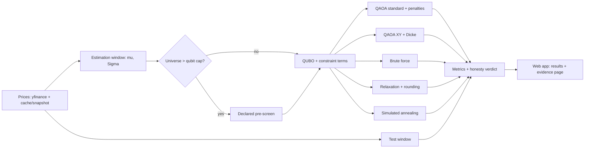

# Quantum Portfolio Optimiser - Plan

## Goal Capsule

- **Objective:** A non-quantum investor can choose NIFTY 50 stocks and investment rules in a web app and get a portfolio that QAOA actually selected. Next to it they see an honest comparison with classical solvers, the effect of hardware noise, and how every answer performs on held-out data. This is the PS-03 submission for Qiskit Fall Fest 2026 (team 4 GOATS).
- **Product authority:** [docs/research/00-problem-statement.md](../research/00-problem-statement.md) (PS-03) comes first. The team POC ([docs/research/01-poc-pdf.md](../research/01-poc-pdf.md)) applies wherever it does not conflict with the PS.
- **Open blockers:** None. The hackathon starts about 5 hours after this plan was written, and work done before the start is allowed. Scope is therefore ordered so a version that covers every PS requirement exists before any add-on.

---

## Product Contract

### Summary

A local web app over NIFTY 50.
- The investor picks stocks and sets risk appetite, portfolio size, sector caps, a target return, capital and optional current holdings.
- One QUBO built from that input is solved by QAOA and by three classical baselines.
- The app shows the chosen portfolio against the efficient frontier and every solver's answer, with live QAOA convergence, the sampled bitstring distribution and an honesty panel.
- An evidence page presents the precomputed depth, optimiser, starting-point and noise studies.

### Problem Frame

PS-03 is judged on three things: whether the QUBO formulation is faithful to the problem, whether the quantum circuit really produces the answer, and whether the classical comparison is honest. A circuit wrapped around a classical answer is explicitly disallowed, and so are look-ahead data and unsupported advantage claims.

Our POC commits to the right ideas but leaves the numbers open. The open items are:
- lookback window and train/test split
- penalty weights
- risk-free rate
- seed count
- weighting scheme
- transaction-cost reference point

The reference repo we were given shows the failure modes concretely. Its "quantum" solver is classical annealing, its headline Sharpe gain compares unlike quantities, and a penalty-coefficient bug makes its QUBO pick the wrong number of assets ([docs/research/02-reference-repo.md](../research/02-reference-repo.md)).

Scale is also a hard limit. Simulated QAOA handles roughly 12–20 qubits without noise and fewer with it, while the PS asks for 10 picks from 50.

### Key Decisions

- **Universes larger than the qubit cap go through a declared classical pre-screen, and every solver uses the reduced set.** (session-settled: user-directed — chosen over hand-picking a small universe only, sector decomposition, or offering both modes: the investor can still start from all 50 while QAOA stays simulable and the comparison stays fair.) Governs R8.
- **Standard-mixer QAOA with penalties is the primary solver. The POC's XY-mixer + Dicke-state variant runs as a comparison arm.** Brandhofer et al. find that the XY advantage disappears under gate noise. Sector caps and costs remain soft penalties in both variants, so feasibility has to be measured either way ([docs/research/04-arxiv-2207.10555.md](../research/04-arxiv-2207.10555.md)). Governs R11.
- **QAOA selects stocks. Weights are equal across the picks and are converted to whole shares for the investor's capital.** This is how "lot sizes" are honoured. Lot-encoded min/max weights are deferred because they multiply the qubit count. Governs R9.
- **Transaction costs are charged relative to the investor's current holdings, or relative to cash when none are entered.** Governs R6.
- **Heavy studies are precomputed and displayed. The live app runs one configuration per job.** A full sweep over depth × optimiser × start × noise takes minutes to hours. Governs R12, R21.
- **No quantum-advantage claims.** The honesty verdict may be neutral or negative. Governs R16.

### Requirements

**Data and risk model**
- R1. The universe is the current NIFTY 50. Daily adjusted closes come from a free source, are cached locally, and ship with a checked-in snapshot so the app works offline or when the API is rate-limited.
- R2. Estimation and test windows are separate, and their dates are shown in the app. μ and Σ come only from the estimation window, and no price after the estimation end date influences any solver.
- R3. Missing data is handled by one documented rule. Excluded tickers and filled gaps are reported to the user.
- R4. Sectors come from the official NIFTY 50 industry classification.

**Problem formulation**
- R5. The selection problem is a single QUBO over binary stock picks: risk-weighted variance minus expected return, plus constraint penalty terms. Every solver receives this same problem.
- R6. At least three constraint types go beyond cardinality: sector caps (maximum picks per sector), transaction cost (Indian delivery-trade cost model), and a minimum target return. Each is a pluggable term, so adding a new one changes no solver.
- R7. Cardinality K and every enabled constraint define feasibility. Each solver's result reports whether it is feasible.
- R8. When the chosen universe exceeds the qubit cap, a declared, solver-agnostic pre-screen reduces it before solving. The app shows the rule and which stocks were kept or dropped.
- R9. The output portfolio is equal-weighted across picks and converted to whole-share quantities for the investor's capital, with leftover cash shown.

**Quantum solver**
- R10. The circuit genuinely produces the answer: QAOA's portfolio is the best feasible bitstring sampled from the optimised circuit. A classical solution may enter only as the declared warm-start strategy, labelled as such wherever its results appear.
- R11. Two QAOA variants exist: the standard mixer with penalties (primary) and the XY mixer with a Dicke-state start (comparison arm).
- R12. Studies cover circuit depth p = 1–5, at least two classical optimisers, and at least two initial-point strategies, one of them a declared warm start.
- R13. The best configuration is re-run under a noise model from a fake IBM backend. The drop in approximation ratio, probability of the optimum, and feasibility is reported against the noiseless run.

**Classical baselines and honesty**
- R14. The baselines are exact brute force on the solved universe, a continuous relaxation with rounding, and simulated annealing. They get the same data, QUBO and constraints as QAOA.
- R15. Each run reports, for every solver: objective, expected return, variance, feasibility and runtime. QAOA additionally reports approximation ratio and probability of sampling the optimum.
- R16. An honesty panel states plainly how QAOA compared on this instance, including neutral or negative outcomes, and never claims advantage.
- R17. Every solver's portfolio is also scored on the test window (realised return, volatility, Sharpe), next to its in-sample numbers.

**Web app**
- R18. The investor sets stocks (or all 50), risk appetite, K, sector caps, target return, capital and optional current holdings. QAOA settings (variant, depth, optimiser, initial point, shots, noise) have working defaults under an "advanced" panel.
- R19. A run is a background job. The app shows progress and a live convergence curve, supports cancel, and reports failures in plain language.
- R20. The results view shows:
  - the portfolio table (shares, weights, sectors)
  - return, variance and objective
  - the efficient frontier with every solver's portfolio plotted
  - the convergence curve
  - the sampled bitstring distribution with feasible states marked
  - the honesty panel
- R21. An evidence page presents the precomputed studies (depth, optimiser, initial point, mixer, noise) with the instance, seeds and settings that produced them.
- R22. The app is usable at phone width, and quantum terms carry plain-language explanations.

### Key Flows

- F1. Investor run
  - **Trigger:** The investor opens the app.
  - **Steps:**
    1. Choose stocks or all 50, then set K, risk appetite, caps, target return, capital and holdings.
    2. If the universe exceeds the cap, review the pre-screen result.
    3. Run, and watch progress and convergence.
    4. Read the portfolio, comparisons and honesty panel.
    5. Adjust and re-run.
  - **Covered by:** R8, R18, R19, R20
- F2. Judge reviews evidence
  - **Trigger:** A judge opens the evidence page.
  - **Steps:** Read the depth, optimiser, initial-point, mixer and noise charts. Open the instance details to see data dates, seeds and settings.
  - **Covered by:** R12, R13, R21

### Acceptance Examples

- AE1. **Covers R8.** Given all 50 stocks are selected with K=10, when the investor runs, the app first shows the kept subset and the screening rule, and every solver's result refers only to that subset.
- AE2. **Covers R7, R10.** Given no sampled QAOA bitstring is feasible, the app reports that QAOA found no feasible portfolio and shows its feasibility as zero. It does not silently repair the result.
- AE3. **Covers R6.** Given current holdings are entered, a portfolio that keeps them shows a lower transaction cost than one that replaces them, and the cost appears in the objective breakdown.
- AE4. **Covers R2.** Given an estimation end date D, changing any price after D leaves μ, Σ and every solver's selection unchanged.
- AE5. **Covers R19.** Given noise simulation is on, the run shows progress, can be cancelled, and the rest of the app stays responsive.
- AE6. **Covers R1.** Given the price API is unreachable, the app runs from the snapshot and labels the data's as-of date.

### Success Criteria

- Each of PS-03 objectives 1–6 can be pointed to in the running app or on the evidence page.
- A default live run finishes in under a minute on a team laptop. It uses about 10 assets, p ≤ 3 and no noise, and covers QAOA plus all baselines.
- With the network off, the demo works end to end from the snapshot.
- Any number on screen can be traced to its data dates, instance, seed and settings.

### Scope Boundaries

- **Deferred for later (stretch, in priority order):**
  1. Consensus heatmap of which solvers pick which stocks (from the POC).
  2. Lot-encoded min/max weights.
  3. A real IBM hardware run with job IDs.
  4. Tabu search.
  5. More mixer families.
- **Out of scope:**
  - Public deployment (mobile use means a responsive layout over the local network).
  - User accounts.
  - Intraday data.
  - Multi-period rebalancing backtests beyond the single test window.
  - Personalised investment advice.

### Dependencies / Assumptions

- The build is split across four teams working in parallel: three with Antigravity, one with Claude Code. Modules must therefore be separable behind contracts agreed up front.
- The constituent list is today's, applied to historical prices. This survivorship bias is stated in the app rather than corrected.
- The Python stack (Qiskit 2.5 + Aer + IBM Runtime fake backends, CVXPY, yfinance) installs on the team's Windows machines. A spike is verifying this.
- Optional upstream packages (qiskit-finance, qiskit-algorithms, qiskit-optimization) are unsupported or archived, so the solver path must not depend on them ([docs/research/05-stack-state.md](../research/05-stack-state.md)).

### Outstanding Questions

**Deferred to Planning**
- Qubit cap value, and the exact pre-screen rule.
- How the target return is encoded in the QUBO (slack bits vs a shortfall penalty).
- Lengths of the estimation and test windows.
- Penalty-weight tuning rule.
- Which fake backend to use.
- Source of the SPSA optimiser.
- Warm-start construction.
- Missing-data threshold.

### Sources / Research

- [docs/research/00-problem-statement.md](../research/00-problem-statement.md): PS-03, the product authority.
- [docs/research/01-poc-pdf.md](../research/01-poc-pdf.md): team POC and the gaps it leaves.
- [docs/research/02-reference-repo.md](../research/02-reference-repo.md): pitfalls to test against, including penalty double-counting and undeclared repair.
- [docs/research/03-qiskit-finance-tutorial.md](../research/03-qiskit-finance-tutorial.md): baseline formulation and bitstring endianness.
- [docs/research/04-arxiv-2207.10555.md](../research/04-arxiv-2207.10555.md): mixer, penalty and initial-point practice; metric definitions.
- [docs/research/05-stack-state.md](../research/05-stack-state.md): current library status and pins.
