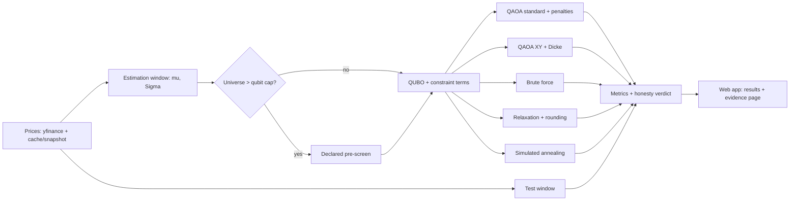
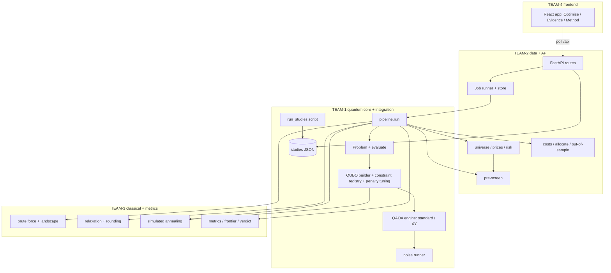
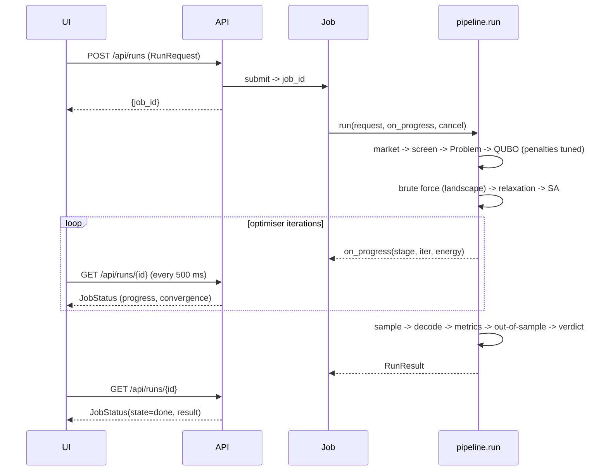

# Quantum Portfolio Optimiser - Plan

## Goal Capsule

- **Objective:** A non-quantum investor can choose NIFTY 50 stocks and investment rules in a web app, get a portfolio that QAOA genuinely selected, and see beside it an honest comparison with classical solvers, the effect of hardware noise, and how every answer performs on held-out data. This is the PS-03 submission for Qiskit Fall Fest 2026 (team 4 GOATS).
- **Means:** a FastAPI backend with our own QAOA loop on Qiskit 2.5 V2 primitives (KTD1), one shared QUBO built from a pluggable constraint registry (KTD3), and a React app. Four teams build it in parallel against interfaces that are frozen first (KTD15).
- **Product authority:** [docs/research/00-problem-statement.md](../research/00-problem-statement.md) (PS-03) comes first, then this Product Contract, then the team POC ([docs/research/01-poc-pdf.md](../research/01-poc-pdf.md)). Interface shapes are owned by [docs/teams/CONTRACTS.md](../teams/CONTRACTS.md).
- **Execution profile:** 3 teams use Google Antigravity (TEAM-2, TEAM-3, TEAM-4) and 1 uses Claude Code (TEAM-1, the integrator). Coding subagents run on Sonnet and research subagents on Haiku. Cost is kept low.
- **Stop conditions:** stop and escalate to TEAM-1 when any of these would happen:
  - an interface in `docs/teams/CONTRACTS.md` would change;
  - a PS-03 "Not allowed" rule would be bent;
  - a new dependency is needed.
- **Who finishes:** TEAM-1 merges each team's branch, runs the Verification Contract, and owns the demo build.
- **Open blockers:** none. The hackathon starts about 5 hours after this plan was written, and prework is allowed (U1, U2).

---

## Product Contract

Product Contract preservation: Product Contract unchanged. The planning-time Outstanding Questions it listed are resolved in the Planning Contract (KTD3–KTD11) and removed here.

### Summary

The app is a local web app over NIFTY 50.
- The investor picks stocks and sets risk appetite, portfolio size, sector caps, a target return, capital and optional current holdings.
- The app builds one QUBO from those inputs. QAOA and three classical baselines all solve it.
- The results show the chosen portfolio against the efficient frontier and every solver's answer, with live QAOA convergence, the sampled bitstring distribution and an honesty panel.
- An evidence page presents precomputed studies of depth, optimiser, starting point and noise.

### Problem Frame

PS-03 is judged on three things: whether the QUBO formulation is faithful, whether the quantum circuit genuinely produces the answer, and whether the classical comparison is honest. It explicitly disallows a circuit wrapped around a classical answer, look-ahead data, and unsupported advantage claims.

Our POC commits to the right ideas but leaves the numbers open: lookback window, split, penalty weights, risk-free rate, seed count, weighting scheme and transaction-cost reference.

The reference repo we were given shows the failure modes concretely ([docs/research/02-reference-repo.md](../research/02-reference-repo.md)):
- its "quantum" solver is classical annealing;
- its headline Sharpe gain compares unlike quantities;
- a penalty-coefficient bug makes its QUBO pick the wrong number of assets.

Scale is also a hard limit. Simulated QAOA handles roughly 12–20 qubits without noise and fewer with it, while the PS asks for 10 picks from 50.

### Key Decisions

- **Universes larger than the qubit cap go through a declared classical pre-screen, and every solver uses the reduced set.** (session-settled: user-directed — chosen over hand-picking a small universe only, sector decomposition, or offering both modes: the investor can still start from all 50 while QAOA stays simulable and the comparison stays fair.) Governs R8.
- **The primary solver is standard-mixer QAOA with penalties. The POC's XY-mixer + Dicke-state variant is a comparison arm.** Brandhofer et al. find the XY advantage disappears under gate noise. Sector caps and costs remain soft penalties in both, so feasibility is measured either way. Governs R11.
- **QAOA selects stocks. Weights are equal across picks and converted to whole shares for the investor's capital.** This is how "lot sizes" are honoured. Lot-encoded min/max weights are deferred because they multiply qubit count. Governs R9.
- **Transaction costs are charged relative to the investor's current holdings, or relative to cash when none are entered.** Governs R6.
- **Heavy studies are precomputed and displayed. The live app runs one configuration per job.** A full sweep takes minutes to hours. Governs R12, R21.
- **No quantum-advantage claims.** The honesty verdict may be neutral or negative. Governs R16.

### Requirements

**Data and risk model**
- R1. The universe is the current NIFTY 50. Daily adjusted closes come from a free source, are cached locally, and ship with a checked-in snapshot so the app works offline or when rate-limited.
- R2. Estimation and test windows are separate, and their dates are shown in the app. μ and Σ come only from the estimation window. No price after the estimation end date influences any solver.
- R3. Missing data is handled by one documented rule. Excluded tickers and filled gaps are reported to the user.
- R4. Sectors come from the official NIFTY 50 industry classification.

**Problem formulation**
- R5. The selection problem is a single QUBO over binary stock picks: risk-weighted variance minus expected return, plus constraint penalty terms. Every solver receives this same problem.
- R6. At least three constraint types go beyond cardinality: sector caps (maximum picks per sector), transaction cost (Indian delivery-trade cost model), and a minimum target return. Each is a pluggable term, so adding one changes no solver.
- R7. Cardinality K and every enabled constraint define feasibility. Each solver's result reports whether it is feasible.
- R8. When the chosen universe exceeds the qubit cap, a declared, solver-agnostic pre-screen reduces it before solving. The app shows the rule and which stocks were kept or dropped.
- R9. The output portfolio is equal-weighted across picks and converted to whole-share quantities for the investor's capital, with leftover cash shown.

**Quantum solver**
- R10. The circuit genuinely produces the answer. QAOA's portfolio is the best feasible bitstring sampled from the optimised circuit. A classical solution may enter only as a declared warm-start strategy, labelled wherever its results appear.
- R11. Two QAOA variants exist: the standard mixer with penalties (primary) and the XY mixer with a Dicke-state start (comparison arm).
- R12. Studies cover circuit depth p = 1–5, at least two classical optimisers, and at least two initial-point strategies, one of them a declared warm start.
- R13. The best configuration is re-run under a noise model from a fake IBM backend. The drop in approximation ratio, probability of the optimum, and feasibility is reported against the noiseless run.

**Classical baselines and honesty**
- R14. The baselines are exact brute force on the solved universe, a continuous relaxation with rounding, and simulated annealing. Each gets the same data, QUBO and constraints as QAOA.
- R15. Each run reports objective, expected return, variance, feasibility and runtime for every solver. For QAOA it also reports approximation ratio and probability of sampling the optimum.
- R16. An honesty panel states plainly how QAOA compared on this instance, including neutral or negative outcomes. It never claims advantage.
- R17. Every solver's portfolio is also scored on the test window (realised return, volatility, Sharpe), next to its in-sample numbers.

**Web app**
- R18. The investor sets stocks (or all 50), risk appetite, K, sector caps, target return, capital and optional current holdings. QAOA settings (variant, depth, optimiser, initial point, shots, noise) have working defaults under an "advanced" panel.
- R19. A run is a background job with progress and a live convergence curve. It can be cancelled and reports failures in plain language.
- R20. The results view shows:
  - a portfolio table (shares, weights, sectors);
  - return, variance and objective;
  - the efficient frontier with every solver's portfolio plotted;
  - the convergence curve;
  - the sampled bitstring distribution with feasible states marked;
  - the honesty panel.
- R21. An evidence page presents the precomputed studies (depth, optimiser, initial point, mixer, noise), with the instance, seeds and settings that produced them.
- R22. The app is usable at phone width. Quantum terms carry plain-language explanations.



### Key Flows

- F1. Investor run
  - **Trigger:** The investor opens the app.
  - **Steps:**
    1. Choose stocks or all 50, then set K, risk appetite, caps, target return, capital and holdings.
    2. If the universe exceeds the cap, review the pre-screen result.
    3. Run, and watch progress and convergence.
    4. Read the portfolio, comparisons and honesty panel.
    5. Adjust and re-run.
  - **Covered by:** R8, R18, R19, R20
- F2. Judge reviews evidence
  - **Trigger:** A judge opens the evidence page.
  - **Steps:** Read the depth, optimiser, initial-point, mixer and noise charts. Open the instance details to see data dates, seeds and settings.
  - **Covered by:** R12, R13, R21

### Acceptance Examples

- AE1. **Covers R8.** Given all 50 stocks are selected with K=10, when the investor runs, the app first shows the kept subset and the screening rule. Every solver's result refers only to that subset.
- AE2. **Covers R7, R10.** Given no sampled QAOA bitstring is feasible, the app reports that QAOA found no feasible portfolio, with feasibility shown as zero. It does not silently repair.
- AE3. **Covers R6.** Given current holdings are entered, a portfolio that keeps them shows a lower transaction cost than one that replaces them. The cost appears in the objective breakdown.
- AE4. **Covers R2.** Given an estimation end date D, changing any price after D leaves μ, Σ and every solver's selection unchanged.
- AE5. **Covers R19.** Given noise simulation is on, the run shows progress and can be cancelled while the app stays responsive.
- AE6. **Covers R1.** Given the price API is unreachable, the app runs from the snapshot and labels the data's as-of date.

### Success Criteria

- Each of PS-03 objectives 1–6 can be pointed to in the running app or on the evidence page.
- A default live run finishes in under a minute on a team laptop. It uses about 10 assets, p ≤ 3, no noise, and QAOA plus all baselines.
- With the network off, the demo works end to end from the snapshot.
- Any number on screen can be traced to its data dates, instance, seed and settings.

### Scope Boundaries

- **Deferred for later (stretch, in priority order):**
  1. A consensus heatmap of which solvers pick which stocks (from the POC).
  2. Lot-encoded min/max weights.
  3. A real IBM hardware run with job IDs.
  4. Egger-style warm-start initial state.
  5. Tabu search.
  6. More mixer families.
- **Out of scope:**
  - public deployment (mobile use means a responsive layout over the local network);
  - user accounts;
  - intraday data;
  - multi-period rebalancing backtests beyond the single test window;
  - covariance shrinkage;
  - personalised investment advice.
- **Considered and not built:**
  - **Penalty "repair" of infeasible QAOA samples.** It would hide R10 failures. Revisit only if a declared, identical repair is applied to every solver.
  - **Persisted run history.** Runs live in memory. Revisit if judges need results to survive a server restart.

### Dependencies / Assumptions

- The build is split across four teams working in parallel: TEAM-1 on Claude Code, TEAM-2/3/4 on Antigravity. Modules are separated behind the interfaces in [docs/teams/CONTRACTS.md](../teams/CONTRACTS.md).
- Today's constituent list is applied to historical prices. This survivorship bias is stated in the app, not corrected. Constituent changes are listed in [docs/research/06-nifty50-costs.md](../research/06-nifty50-costs.md).
- The stack is verified on the team laptop: Python 3.13, qiskit 2.5.2, qiskit-aer 0.17.2, qiskit-ibm-runtime 0.50.0, cvxpy 1.9.3, yfinance 1.7.0, fastapi 0.143.0 ([docs/research/08-env-spike.md](../research/08-env-spike.md)).
- The solver path does not depend on the unsupported or archived qiskit-finance, qiskit-algorithms or qiskit-optimization ([docs/research/05-stack-state.md](../research/05-stack-state.md)).

### Sources / Research

- [docs/research/00-problem-statement.md](../research/00-problem-statement.md): PS-03, the product authority.
- [docs/research/01-poc-pdf.md](../research/01-poc-pdf.md): team POC and the gaps it leaves.
- [docs/research/02-reference-repo.md](../research/02-reference-repo.md): pitfalls to test against (penalty double-count, undeclared repair).
- [docs/research/03-qiskit-finance-tutorial.md](../research/03-qiskit-finance-tutorial.md): baseline formulation and bitstring endianness.
- [docs/research/04-arxiv-2207.10555.md](../research/04-arxiv-2207.10555.md): mixer, penalty and initial-point practice, and metric definitions.
- [docs/research/05-stack-state.md](../research/05-stack-state.md): library status.
- [docs/research/06-nifty50-costs.md](../research/06-nifty50-costs.md): constituents and sectors, Indian costs, risk-free rate, ticker traps.
- [docs/research/07-agent-tooling.md](../research/07-agent-tooling.md): Antigravity + Claude Code shared setup.
- [docs/research/08-env-spike.md](../research/08-env-spike.md): verified versions and working Qiskit/Aer/yfinance patterns.

---

## Planning Contract

### Key Technical Decisions

- KTD1. **Write our own QAOA loop on Qiskit 2.5 V2 primitives.** The loop is `QAOAAnsatz`, flattened, then `StatevectorEstimator` for ⟨H⟩, then our optimiser, then `StatevectorSampler` for final samples. It uses no qiskit-optimization, qiskit-finance or qiskit-algorithms. Flattening (decomposing `QAOA`/`PauliEvolution` blocks) makes an eval about 25× faster and is required by Aer. (session-settled: user-approved — chosen over the archived qiskit-optimization `QAOA` class: it avoids an archived dependency and gives full control of the mixer, initial point and live convergence.) Governs R10, R11.
- KTD2. **Scale the objective to the equal-weight portfolio.**
  - F(x) = q·xᵀΣx/K² − (1−q)·(μᵀx/K − tc(x)), with risk aversion q ∈ [0,1].
  - Evaluating any selection therefore gives that equal-weight portfolio's exact risk-penalised net return.
  - Every solver minimises this F plus the same penalties.
  - Governs R5, R9.
- KTD3. **The constraint registry has two term kinds plus an objective kind.**
  - Equality terms become quadratic penalties, e.g. cardinality A·(Σx−K)², with Q_ij + Q_ji summing to 2A per pair (the bug in the reference repo, as a test).
  - Linear inequalities a·x ≤ b become slack bits in the builder:
    - sector cap: Σ_{i∈s} x_i ≤ cap, with ⌈log2(cap+1)⌉ bits, only for sectors with more candidates than cap;
    - target return: μᵀx/K − tc(x) ≥ R, with 3-bit discretised slack.
  - Transaction cost is an objective term.
  - A new constraint is a new registry entry, and solvers are untouched.
  - Governs R6, R7.
- KTD4. **Tune penalty weights by brute force over the QUBO.** The QUBO has at most 16 variables, so at most 65,536 states.
  - Use a doubling schedule from 0.5× the objective spread.
  - Pick the smallest weight such that the infeasible minimum is ≥ ½(F_min + F̄_feasible) (Brandhofer Eq. 11).
  - Feasibility is always re-checked exactly by `Problem.evaluate`.
  - Governs R7, R10.
- KTD5. **The qubit cap is 16 variables (assets + slack), the size of FakeGuadalupeV2.** Every live configuration can then be noise-simulated in about 0.4 s per 2k shots.
  - Pre-screen rule: rank candidates by estimation-window Sharpe (μ_i − r_f)/σ_i.
  - Keep the top N = 16 − slack bits.
  - When caps are on, keep at most cap+1 per sector.
  - Inherits the session-settled pre-screen decision. Governs R8.
- KTD6. **QAOA's answer is the best feasible sampled bitstring, judged by an exact check, with no repair.** Reported metrics:
  - expected approximation ratio over samples (Brandhofer Eq. 8, r = 0 for infeasible);
  - P(opt), with the uniform-random baseline 1/|feasible|;
  - feasible rate;
  - the most-probable bitstring.
  - Governs R10, R15.
- KTD7. **Initial-point strategies:** random (seeded uniform), linear ramp (TQA-style), and a declared "warm start" that interpolates optimal parameters from depth p−1 (INTERP). No classical solution enters the circuit. Egger-style state warm start is deferred. Governs R10, R12.
- KTD8. **Optimisers:** COBYLA and Nelder–Mead from scipy, plus SPSA (our own seeded ~30-line implementation, because qiskit-algorithms is unsupported). Governs R12.
- KTD9. **The XY variant** uses:
  - a deterministic Dicke(n_assets, K) circuit (Bärtschi–Eidenbenz, verified fidelity 1.0);
  - a ring XY mixer of `XXPlusYYGate(2β, 0)` on asset qubits;
  - an X mixer on slack qubits;
  - no cardinality term, since it is constant inside the subspace.
  - Governs R11.
- KTD10. **Noise:** FakeGuadalupeV2 `NoiseModel.from_backend`, Aer `SamplerV2`/`EstimatorV2` with `backend_options.noise_model`, transpile at optimisation level 1, and `H.apply_layout`. The live toggle optimises under noise. The study reports ideal parameters sampled noisy, and noisy-optimised. Governs R13.
- KTD11. **Data:**
  - A checked-in parquet snapshot of adjusted closes: 50 tickers plus `^NSEI`, 2023-09-01 → 2026-10-07.
  - Live yfinance refresh is optional, with a parquet cache.
  - Daily log returns. μ and Σ are annualised ×252 from the estimation window (2023-10-01 → 2025-09-30). The test window is 2025-10-01 → 2026-09-30.
  - Exclude a ticker with > 5% missing in the estimation window. Forward-fill gaps ≤ 3 days.
  - `TMPV.NS` is excluded by default (demerger break on 2025-10-14).
  - r_f = 5.57%. Delivery costs: c_buy = 0.1187%, c_sell = 0.1037% ([docs/research/06-nifty50-costs.md](../research/06-nifty50-costs.md)).
  - Governs R1–R4, R6, R17.
- KTD12. **Baselines:**
  - **Brute force** enumerates every K-subset under the exact constraints. It also produces the landscape (F_min, F_max, F̄, discrete frontier) that the metrics use.
  - **Relaxation** is a CVXPY convex QP over 0 ≤ x ≤ 1 with the linear constraints. Rounding takes the top-K by relaxed value, and the declared rounding rule is reported. It does no hidden repair.
  - **SA** is single-flip Metropolis on the same QUBO (including slack), seeded.
  - Governs R14.
- KTD13. **Jobs:** an in-process `ThreadPoolExecutor(max_workers=1)` with an in-memory job store. A cancel flag is checked in the optimiser callback, and the UI polls every 500 ms. Governs R19.
- KTD14. **Frontend:** React 19 + Vite 8 + TypeScript + Tailwind 4 (`@tailwindcss/vite`) + Recharts 3. Mock mode replays `contracts/api-examples/*.json`, and the dev server proxies `/api` to `:8000`. Governs R18–R22.
- KTD15. **Ownership is by team and directory, and interfaces are frozen first.** [docs/teams/CONTRACTS.md](../teams/CONTRACTS.md) is authoritative, and only TEAM-1 changes it. Each team works on `team-N/*` branches, and TEAM-1 merges. (session-settled: user-approved — chosen over one shared branch with no ownership: four agent-driven teams editing the same files would collide.) Governs R5–R22 delivery.
- KTD16. **Studies are precomputed by a script into JSON and served read-only.** The instance set is 10 random 10-asset, K=5 instances drawn from the estimation window, with fixed seeds. Studies cover depth p = 1–5 × {standard, XY}, optimiser × init, and noise. Governs R12, R13, R21.

### High-Level Technical Design

Components, ownership and data flow:



One run, in sequence:



Team timeline (the event clock starts at T0):

| Phase | When | TEAM-1 (Claude) | TEAM-2 (AG) | TEAM-3 (AG) | TEAM-4 (AG) |
|---|---|---|---|---|---|
| Prework | before T0 | U1 scaffold + contracts, U2 rules + briefs | read brief, set up Antigravity | read brief | read brief |
| Build | T0 → T0+2.5h | U5 QUBO, U6 QAOA | U3 data, U4 screen/costs/OOS | U8 baselines, U9 metrics | U12 shell + form on mocks |
| Integrate | T0+2.5h → T0+4h | U10 pipeline, U7 noise | U11 API + jobs | support U10, fix metrics | U13 results + evidence views |
| Evidence + demo | T0+4h → T0+5h | U14 studies, U15 integration | U15 offline/demo checks | U15 tests | U15 mobile polish |
| Offline phase | after online | XY polish, stretch items | stretch items | stretch items | stretch items |

### Output Structure

```text
AGENTS.md                      # shared rules (both tools)
CLAUDE.md                      # @AGENTS.md + Claude-only notes
docs/teams/CONTRACTS.md        # frozen interfaces (TEAM-1 owns)
docs/teams/TEAM-1.md .. TEAM-4.md
contracts/api-examples/*.json  # example payloads (TEAM-1); frontend mocks + API tests
backend/
  pyproject.toml uv.lock .python-version
  qportfolio/
    contracts.py problem.py pipeline.py          # TEAM-1
    qubo/ builder.py constraints.py penalty.py ising.py      # TEAM-1
    quantum/ qaoa.py ansatz.py optimizers.py init_points.py noise.py  # TEAM-1
    data/ universe.py prices.py risk.py screen.py costs.py allocate.py evaluate.py  # TEAM-2
    api/ main.py jobs.py studies.py                # TEAM-2
    classical/ brute_force.py relaxation.py annealing.py   # TEAM-3
    metrics.py frontier.py verdict.py              # TEAM-3
  scripts/ smoke.py fetch_snapshot.py run_studies.py
  data/ nifty50.csv snapshot/prices.parquet studies/*.json
  tests/ test_*.py
frontend/
  package.json vite.config.ts index.html
  src/ main.tsx App.tsx api/ components/ pages/ mocks/ lib/
```

### Risks & Dependencies

| Risk | Mitigation |
|---|---|
| An Antigravity agent edits files outside its area, or deletes directories | Ownership table in `AGENTS.md`; Request review on; sandbox on; Turbo off; `team-N/*` branches; commit before each agent run |
| Agents use stale Qiskit APIs (`qiskit.algorithms`, `execute`, V1 `Sampler`, `from qiskit import Aer`) | `AGENTS.md` bans them; only the patterns in `backend/scripts/smoke.py` and [docs/research/08-env-spike.md](../research/08-env-spike.md) are allowed |
| Agents use pandas-2 idioms on pandas 3 (`applymap`, chained assignment) | Called out in `AGENTS.md`; tests run on the pinned lock |
| Interfaces drift between teams | `CONTRACTS.md` plus example JSON; a test asserts that `contracts.py` models parse every example file |
| Yahoo outage or rate limit during the demo | Snapshot is checked in; `source` and `as_of` are shown in the UI (AE6) |
| QAOA underperforms classical | Expected at n ≤ 16. The honesty panel reports it (R16), and the PS welcomes neutral findings |
| XY variant degrades badly under noise (~4× the CX count) | Report it as a finding (KTD9, KTD10) and keep standard as primary |
| Time overrun | Cut order: U14 study breadth, then the XY variant in the live UI, then the noise toggle in the live UI (studies still show noise) |
| Repo path contains spaces on Windows | Quote paths; scripts resolve paths relative to their own file |

---

## Implementation Units

| U-ID | Title | Team | Key files | Depends on |
|---|---|---|---|---|
| U1 | Scaffold + frozen contracts + example payloads | TEAM-1 (prework) | `backend/qportfolio/contracts.py`, `problem.py`, `contracts/api-examples/` | — |
| U2 | Shared agent rules + team briefs | TEAM-1 (prework) | `AGENTS.md`, `CLAUDE.md`, `docs/teams/` | U1 spec |
| U3 | Data layer: universe, prices, windows, μ/Σ | TEAM-2 | `backend/qportfolio/data/{universe,prices,risk}.py` | U1 |
| U4 | Pre-screen, costs, allocation, out-of-sample | TEAM-2 | `backend/qportfolio/data/{screen,costs,allocate,evaluate}.py` | U1, U3 |
| U5 | QUBO builder, constraint registry, penalties, Ising | TEAM-1 | `backend/qportfolio/qubo/` | U1 |
| U6 | QAOA engine (standard + XY), optimisers, init points | TEAM-1 | `backend/qportfolio/quantum/` | U5 |
| U7 | Noise runner (fake backend) | TEAM-1 | `backend/qportfolio/quantum/noise.py` | U6 |
| U8 | Classical baselines | TEAM-3 | `backend/qportfolio/classical/` | U1 |
| U9 | Metrics, frontier, verdict | TEAM-3 | `backend/qportfolio/{metrics,frontier,verdict}.py` | U1, U8 |
| U10 | Pipeline orchestrator | TEAM-1 | `backend/qportfolio/pipeline.py` | U3–U9 |
| U11 | API + job runner + studies endpoint | TEAM-2 | `backend/qportfolio/api/` | U1 (stub pipeline), U10 |
| U12 | Frontend shell, form, mocks, API client | TEAM-4 | `frontend/` | U1 examples |
| U13 | Frontend results views, charts, evidence page | TEAM-4 | `frontend/src/components`, `pages` | U12 |
| U14 | Evidence studies script + checked-in results | TEAM-1 | `backend/scripts/run_studies.py`, `backend/data/studies/` | U6, U7, U8, U9 |
| U15 | Integration, offline demo hardening, README | all (TEAM-1 leads) | `README.md`, fixes | U10–U14 |

### U1. Scaffold + frozen contracts + example payloads

**Goal:** Give every team a runnable skeleton and the exact interfaces before the event, so all four can work in parallel from T0.

**Requirements:** R5, R7, R15, R18–R21 (interfaces). Delivers KTD15.

**Dependencies:** none.

**Files:**
- `backend/pyproject.toml`, `backend/uv.lock`, `backend/.python-version`
- `backend/qportfolio/__init__.py`, `backend/qportfolio/contracts.py`, `backend/qportfolio/problem.py`
- `backend/qportfolio/pipeline.py`: a stub that returns the example `RunResult`
- empty packages `data/`, `qubo/`, `quantum/`, `classical/`, `api/` with `__init__.py`
- `backend/scripts/smoke.py`, copied from the spike
- `backend/data/nifty50.csv`, from [docs/research/06-nifty50-costs.md](../research/06-nifty50-costs.md)
- `contracts/api-examples/{universe,run_request,screen,job_running,job_done,job_error,studies_index,study_depth}.json`
- `backend/tests/test_contracts.py`, `backend/tests/test_problem.py`
- `.gitignore`

**Approach:**
1. Run `uv init`, then `uv python pin 3.13`, then add the verified pins from the Dependencies section, with `httpx2` as a dev dependency.
2. Write pydantic models in `contracts.py` that mirror [docs/teams/CONTRACTS.md](../teams/CONTRACTS.md) one-to-one.
3. Write `problem.py` with the `Problem` dataclass and the exact `evaluate(selection)`: objective per KTD2, plus feasibility and violations for cardinality, sector cap and target return. TEAM-3 depends on it from T0.
4. Hand-write example JSON for a realistic 10-asset, K=5 instance. The values must be internally consistent.

**Patterns to follow:** [docs/research/08-env-spike.md](../research/08-env-spike.md) for pins and gotchas.

**Test scenarios:**
- Every file in `contracts/api-examples/` parses into its pydantic model without error.
- For a 4-asset `Problem` with K=2 and no other constraints, `evaluate` matches a hand computation: q·xᵀΣx/K² − (1−q)·μᵀx/K.
- A selection of K+1 assets returns `feasible=false` with a cardinality violation.
- With a sector cap of 1, two picks in the same sector return `feasible=false` and name the sector.
- When the target return exceeds the selection's net return, the result is `feasible=false` with a target-return violation.

**Verification:** `uv run pytest` passes, `uv run python scripts/smoke.py` passes, and the stub pipeline returns the example `RunResult`.

### U2. Shared agent rules + team briefs

**Goal:** Each team can start its agent with one copy-paste prompt and stay inside its own files.

**Requirements:** delivery of KTD15. **Dependencies:** U1 spec (`CONTRACTS.md`).

**Files:** `AGENTS.md`, `CLAUDE.md`, `docs/teams/CONTRACTS.md`, `docs/teams/TEAM-1.md`, `docs/teams/TEAM-2.md`, `docs/teams/TEAM-3.md`, `docs/teams/TEAM-4.md`.

**Approach:**
1. `AGENTS.md` holds the ownership table, the PS-03 honesty rules, banned APIs, Windows notes, commands and git rules. Keep it under 200 lines.
2. `CLAUDE.md` contains `@AGENTS.md` plus Claude-only notes.
3. Each brief contains: role, owned and do-not-touch paths, units, settings for the team's tool, a kickoff prompt, per-phase follow-up prompts, verification, definition of done, and handoff steps ([docs/research/07-agent-tooling.md](../research/07-agent-tooling.md)).

**Test expectation:** none, because this unit is documentation. Verify by reading it cold: a teammate can start their agent from their brief alone.

### U3. Data layer: universe, prices, windows, μ/Σ

**Goal:** Turn the snapshot (or a live refresh) into a `Market` for any ticker set with no look-ahead.

**Requirements:** R1, R2, R3, R4; AE4, AE6. Follows KTD11.

**Dependencies:** U1.

**Files:**
- `backend/qportfolio/data/universe.py`, `prices.py`, `risk.py`
- `backend/scripts/fetch_snapshot.py`
- `backend/data/snapshot/prices.parquet`
- `backend/tests/test_data.py`

**Approach:**
1. `fetch_snapshot.py` makes one batched `yf.download` call for 50 tickers plus `^NSEI`, with `auto_adjust=True`. It reorders the `Close` columns to the input order and writes parquet.
2. `prices.load_prices` reads the cache, then the snapshot, then falls back to live. It reports `source` and `as_of`.
3. `risk.build_market` slices the windows strictly by date. It applies the missing-data rule and the TMPV exclusion, then computes annualised μ and Σ, the estimation-end prices, and test-window returns.

**Patterns to follow:** yfinance handling in [docs/research/08-env-spike.md](../research/08-env-spike.md) (MultiIndex, alphabetical order, exclusive `end`).

**Test scenarios:**
- Covers AE4. Change every price after the estimation end to random values. μ, Σ and the estimation-end prices are unchanged.
- A ticker with 10% missing estimation-window rows is excluded, and `excluded` gives a reason.
- A 2-day gap is forward-filled, and `filled` counts 2 for that ticker.
- `TMPV.NS` is excluded by default with the demerger reason.
- Covers AE6. With the network patched to fail, `load_prices` returns `source="snapshot"` and its `as_of` date.
- Σ is symmetric and positive semi-definite (min eigenvalue ≥ −1e-10).
- `load_universe` returns 50 assets, each with a non-empty sector.

**Verification:** tests pass, and `build_market` on all 50 tickers finishes in under 2 s from the snapshot.

### U4. Pre-screen, costs, allocation, out-of-sample

**Goal:** Supply the declared screen, the cost terms for the QUBO, whole-share portfolios, and held-out scoring.

**Requirements:** R6, R8, R9, R17; AE1, AE3. Follows KTD5 and KTD11.

**Dependencies:** U1, U3.

**Files:**
- `backend/qportfolio/data/screen.py`, `costs.py`, `allocate.py`, `evaluate.py`
- `backend/tests/test_screen_costs.py`

**Approach:**
1. `prescreen` ranks by estimation-window Sharpe, applies the per-sector limit, keeps N = budget − slack bits, and returns the rule text plus kept and dropped tickers.
2. `linear_costs` returns `(lin, const)` so that tc(x) = lin·x + const as a fraction of capital. A buy costs c_buy/K. A held position that is dropped costs c_sell × its holding weight.
3. `to_shares` floors equal-weight values to whole shares at estimation-end prices and reports leftover cash.
4. `out_of_sample` computes buy-and-hold equal-weight annualised return, volatility, Sharpe and max drawdown over the test window, plus the same for `^NSEI`.

**Test scenarios:**
- Covers AE1. With 50 tickers, K=10 and budget 16 (no caps), the screen keeps 16 tickers, all with Sharpe ≥ the best dropped ticker, and the rule text names the metric and the window.
- With sector cap 2, the screen keeps no more than 3 tickers from any one sector.
- Covers AE3. With holdings in A and B, a selection keeping A and B has a lower tc than one swapping both out.
- With no holdings, tc equals the sum of buy costs over the selection.
- With capital ₹10,00,000, K=5 and known prices, share counts are floors of 200,000/price, and cash_left = capital − invested ≥ 0.
- A price above the per-asset budget gives 0 shares with a flagged row, and no crash.
- On a synthetic series that doubles, out-of-sample annualised return is computed correctly and max drawdown is 0.

**Verification:** tests pass. The screen output for the default request matches `contracts/api-examples/screen.json` in shape.

### U5. QUBO builder, constraint registry, penalties, Ising

**Goal:** Build one faithful QUBO from a `Problem`, using pluggable constraints, tuned penalties and an Ising form for QAOA.

**Requirements:** R5, R6, R7. Follows KTD2, KTD3 and KTD4.

**Dependencies:** U1.

**Files:**
- `backend/qportfolio/qubo/constraints.py`, `builder.py`, `penalty.py`, `ising.py`
- `backend/tests/test_qubo.py`

**Approach:**
1. The registry maps a name to a term object. An `equality` term gives a quadratic penalty. An `inequality` term gives a·x ≤ b. An `objective` term gives a linear or quadratic addition.
2. The builder assembles the objective and penalties, appends slack bits for inequalities, and records variable labels (assets first, then slack).
3. `penalty.tune` follows KTD4.
4. `ising.to_sparse_pauli` maps x = (1 − Z)/2 and returns the offset. The Hamiltonian is normalised by its max |coefficient|, and the scale is kept so energies can be reported unscaled.

**Execution note:** Test-first. The reference repo shipped a penalty bug, so the energy-equivalence tests must exist before QAOA consumes this.

**Test scenarios:**
- With penalty-only energy (μ = Σ = 0), the argmin over all bitstrings has exactly K ones, for K ∈ {2, 3, 5}. This guards against the double-count bug.
- For a random 6-asset problem, `E_ising(z) + offset == E_qubo(x)` for all 64 bitstrings, within 1e-9.
- For every feasible selection with slack chosen optimally, the QUBO energy equals the `Problem.evaluate` objective. This holds within 1e-9 for integer-slack terms (cardinality, sector cap), and within C·(Δ/2)² for the discretised target-return slack, where Δ is the slack resolution.
- The tuned penalty makes every infeasible state ≥ ½(F_min + F̄).
- Adding a dummy registry entry, such as "exclude ticker X", changes no solver code. The test registers the entry and builds successfully.
- A sector cap only produces slack bits for sectors with more candidates than the cap.
- When the total variable count exceeds 16, the builder raises a clear error naming the count.

**Verification:** tests pass. Building a 12-asset QUBO with caps and a target return takes under 1 s, including tuning.

### U6. QAOA engine (standard + XY), optimisers, init points

**Goal:** Optimise and sample QAOA circuits, and return samples, convergence and metrics inputs. The answer comes from the circuit.

**Requirements:** R10, R11, R12, R15, R19; AE2. Follows KTD1, KTD6, KTD7, KTD8 and KTD9.

**Dependencies:** U5.

**Files:**
- `backend/qportfolio/quantum/ansatz.py`, `optimizers.py`, `init_points.py`, `qaoa.py`
- `backend/tests/test_qaoa.py`

**Approach:**
1. `ansatz.build` returns a flattened `QAOAAnsatz`.
   - Standard: |+⟩ start with the default mixer.
   - XY: Dicke start with a ring `XXPlusYYGate` mixer on asset qubits and an X mixer on slack qubits.
2. `optimizers` provides `cobyla`, `nelder_mead` and `spsa`. All share one callback signature `(iter, energy, params)` and return the history.
3. `init_points` provides `random`, `ramp` and `interp(prev_params)`.
4. `qaoa.solve`:
   - minimise ⟨H⟩ with `StatevectorEstimator`;
   - call `on_progress` per eval and honour `cancel`;
   - sample with `StatevectorSampler`;
   - decode bitstrings, reversing so that x0 is first, and drop slack bits;
   - evaluate unique selections exactly;
   - choose the best feasible selection, or report none.

**Patterns to follow:** `backend/scripts/smoke.py` checks a and c; [docs/research/08-env-spike.md](../research/08-env-spike.md).

**Test scenarios:**
- On a 6-asset, K=3 instance, p=2 COBYLA reaches an expected approximation ratio > 0.7 and samples the brute-force optimum at least once in 4096 shots, with seed fixed.
- XY variant, noiseless: every sampled asset bitstring has Hamming weight K.
- Decoding: the bitstring "…01" (qubit 0 = 1) maps to asset 0 selected.
- Covers AE2. With a QUBO whose penalties are forced to 0 so that samples are mostly infeasible, the result has `selection=null`, `feasible=false` and `feasible_rate` reported, and nothing is repaired.
- When the cancel flag is set after 3 iterations, `solve` stops within one more evaluation and raises `Cancelled`.
- `interp` maps p=1 parameters [γ1, β1] to two arrays of length 2 that match the hand-computed Zhou et al. linear-interpolation formula.
- SPSA with a fixed seed is deterministic across two runs.

**Verification:** tests pass. A 10-asset, p=3 run with 150 iterations finishes in under 20 s on the laptop.

### U7. Noise runner (fake backend)

**Goal:** Re-run a configuration under FakeGuadalupeV2 noise and report degradation against ideal.

**Requirements:** R13. Follows KTD10.

**Dependencies:** U6.

**Files:** `backend/qportfolio/quantum/noise.py`, `backend/tests/test_noise.py`.

**Approach:**
1. Build the noise model and pass manager once and cache them.
2. Provide two modes:
   - `sample_noisy(params)`: ideal parameters with noisy sampling;
   - `optimise_noisy`: `EstimatorV2` with noise and `apply_layout`.
3. Return the same metric set as ideal, plus circuit depth and two-qubit gate count after transpile.

**Test scenarios:**
- On a 6-asset instance, the noisy sample's feasible rate and P(opt) are each ≤ the ideal values + 0.05, and the report includes both.
- A noisy run on 16 variables completes, and the transpiled circuit uses no more than 16 physical qubits.
- The circuit stats report depth > 0 and two-qubit gates > 0. XY shows more two-qubit gates than standard on the same instance.

**Verification:** tests pass. The noisy 10-asset run finishes in under 60 s.

### U8. Classical baselines

**Goal:** Run three classical solvers on the same `Problem` and QUBO, with honest, declared methods.

**Requirements:** R14, R15. Follows KTD12.

**Dependencies:** U1. Uses the `Problem` interface, plus the QUBO for SA once U5 lands; until then, use a stub QUBO from `Problem`.

**Files:**
- `backend/qportfolio/classical/brute_force.py`, `relaxation.py`, `annealing.py`
- `backend/tests/test_classical.py`

**Approach:**
1. Brute force enumerates `itertools.combinations(n, K)`, vectorised in numpy where easy, and evaluates each exactly. It returns a `SolverResult` plus a `Landscape`: all feasible objectives, returns and variances, F_min, F_max and F̄.
2. Relaxation is a CVXPY problem with `psd_wrap(Σ)`, 0 ≤ x ≤ 1, Σx = K, and the linear constraints. It rounds by top-K and reports the relaxed vector and its rounding rule.
3. SA runs single-flip Metropolis on the QUBO bitstrings with a geometric schedule and a fixed seed. It decodes and evaluates exactly.

**Test scenarios:**
- On the Brandhofer 5-asset fixture (q = 1/3, B = 2), brute force finds {LIN, VNA} with F_min ≈ −0.22608, F_max ≈ 0.08191 and F̄ ≈ −0.08986. Data comes from [docs/research/04-arxiv-2207.10555.md](../research/04-arxiv-2207.10555.md). If the fixture values are not transcribed, use a hand-checked 4-asset case.
- Brute force respects sector caps: no returned selection violates them, and the landscape counts only feasible selections.
- On a convex instance, the relaxation's rounded selection is feasible, and its objective is ≥ the brute-force optimum.
- On a 10-asset, K=5 instance, SA reaches the brute-force optimum in at least 5 of 10 seeds. The observed rate is reported in `details`.
- All three return `runtime_s > 0` and identical `objective` values for identical selections.

**Verification:** tests pass. Brute force on 16 assets with K=8 (12,870 subsets) runs in under 2 s.

### U9. Metrics, frontier, verdict

**Goal:** Compute the honest comparison numbers, the frontier data and the plain-language verdict.

**Requirements:** R15, R16, R20. Follows KTD6.

**Dependencies:** U1, U8 (`Landscape`).

**Files:**
- `backend/qportfolio/metrics.py`, `frontier.py`, `verdict.py`
- `backend/tests/test_metrics.py`

**Approach:**
1. `qaoa_metrics(samples, landscape)` returns the expected approximation ratio (Brandhofer Eq. 8, with r = 0 when infeasible), P(opt), the uniform baseline 1/|feasible|, the feasible rate, and the top-20 samples annotated as feasible or optimal.
2. `frontier` returns two things:
   - the continuous long-only mean-variance frontier, a CVXPY sweep of 25 points;
   - the discrete K-of-n equal-weight Pareto points from the landscape.
3. `verdict` is rule-based. Levels are `matched`, `near` (gap ≤ 1%), `worse`, and `no-feasible`. It always adds the runtime comparison sentence and the size disclaimer, and never uses advantage wording.

**Test scenarios:**
- When all samples are on the optimum, approx_ratio = 1 and p_opt = 1.
- When all samples are infeasible, approx_ratio = 0, feasible_rate = 0, and the verdict level is `no-feasible`.
- Approx ratio uses feasible-only F_min and F_max. On a hand-built landscape, the computed r matches the hand-computed value.
- The verdict text for any input contains none of these banned phrases: "advantage", "outperforms classical", "quantum speedup".
- Every point on the discrete Pareto frontier is non-dominated, and every continuous frontier point has weights summing to 1, each ≥ 0.

**Verification:** tests pass.

### U10. Pipeline orchestrator

**Goal:** Run one request end to end, report progress, and return a `RunResult` that matches the contract.

**Requirements:** R1–R20 integration; AE1, AE2, AE5.

**Dependencies:** U3–U9.

**Files:** `backend/qportfolio/pipeline.py` (replaces the stub), `backend/tests/test_pipeline.py`.

**Approach:**
1. Build the market, then screen if needed, then build the `Problem`, then the QUBO with tuned penalties.
2. Run brute force, relaxation and SA, then QAOA in the selected variant, with noise if requested.
3. Compute metrics, then allocation per solver, then out-of-sample, then the frontier, then the verdict.
4. Stages report progress fractions: data 0.05, screen 0.1, qubo 0.15, classical 0.3, qaoa 0.3–0.9, wrap-up 1.0.

**Test scenarios:**
- The default `run_request.json` produces a `RunResult` that validates against the pydantic model. Every solver has a portfolio and an out-of-sample block.
- Covers AE1. A request with all 50 tickers sets `screen.applied=true`, and every solver's selection ⊆ `screen.kept`.
- `on_progress` receives monotonically non-decreasing fractions that end at 1.0.
- A cancel mid-QAOA raises `Cancelled`, and no partial result is returned.

**Verification:** tests pass. The default request finishes in under 60 s (Success Criteria).

### U11. API + job runner + studies endpoint

**Goal:** Serve the contract over HTTP with background jobs, polling and cancel.

**Requirements:** R18, R19, R21; AE5. Follows KTD13.

**Dependencies:** U1 (stub pipeline) for building. U10 for real results.

**Files:**
- `backend/qportfolio/api/main.py`, `jobs.py`, `studies.py`
- `backend/tests/test_api.py`

**Approach:**
1. Routes follow [docs/teams/CONTRACTS.md](../teams/CONTRACTS.md).
2. The job store is a dict guarded by a lock, plus a `ThreadPoolExecutor(1)`.
3. On error, the job holds a plain-language message and the server log holds the traceback.
4. The studies endpoint reads `backend/data/studies/*.json`.
5. CORS allows the Vite dev origin.

**Test scenarios:**
- `POST /api/runs` returns a `job_id`. Polling reaches `done` with a result that validates. This test uses the stub pipeline.
- `DELETE /api/runs/{id}` while running moves the state to `cancelled` within 2 s.
- A pipeline exception gives `state=error`, with an `error` string that contains no traceback.
- An unknown job id returns 404.
- `GET /api/universe` returns 50 assets with sectors.
- `GET /api/studies` lists each JSON file. `GET /api/studies/{id}` returns its content, and unknown ids return 404.
- `POST /api/screen` with 30 tickers returns kept and dropped lists whose total is 30.

**Verification:** tests pass. `uvicorn` serves, and the frontend's real-API mode works against it.

### U12. Frontend shell, form, mocks, API client

**Goal:** A usable, responsive input flow that works against mocks from T0 and against the real API later.

**Requirements:** R18, R19, R22; F1; AE5.

**Dependencies:** U1 example JSON.

**Files:**
- `frontend/package.json`, `vite.config.ts`, `index.html`
- `frontend/src/{main.tsx,App.tsx}`
- `frontend/src/api/{types.ts,client.ts,mock.ts}`
- `frontend/src/pages/{Optimise,Evidence,Method}.tsx`
- `frontend/src/components/{UniversePicker,ConstraintsForm,AdvancedQaoa,ScreenPreview,RunProgress,DataBanner,Glossary}.tsx`

**Approach:**
1. `types.ts` mirrors CONTRACTS.md by hand.
2. `client.ts` switches to `mock.ts` when `VITE_USE_MOCKS=1`. The mock replays the example JSON and simulates progress over about 5 s.
3. Layout: form on the left and results on the right on desktop, stacked on mobile.
4. Advanced QAOA settings sit collapsed with the defaults from `run_request.json`.
5. Every quantum term gets a tooltip from `Glossary`.

**Test scenarios:**
- `npm run build` passes with no type errors.
- Manual: in mock mode, submitting shows progress, the live convergence line and Cancel, then results. Cancel returns to an idle state.
- Manual: at 375 px width there is no horizontal scroll, and all inputs are reachable and labelled.
- Manual: if the API is down in real mode, a plain-language error with a Retry button appears and nothing crashes.

**Verification:** build passes, and the manual checks pass on desktop and phone width.

### U13. Frontend results views, charts, evidence page

**Goal:** Show the result and the evidence clearly to a non-quantum user.

**Requirements:** R9, R15, R16, R17, R20, R21, R22; F2.

**Dependencies:** U12.

**Files:**
- `frontend/src/components/{PortfolioTable,MetricCards,SolverTable,FrontierChart,ConvergenceChart,BitstringHistogram,HonestyPanel,OutOfSample,StudyChart}.tsx`
- `frontend/src/pages/Evidence.tsx`

**Approach:**
1. Recharts throughout.
2. The frontier uses a scatter plot: the continuous line, discrete points greyed out, and each solver as a labelled marker.
3. The histogram shows the top 20 bitstrings, coloured optimal, feasible or infeasible, with a legend that explains each.
4. The honesty panel shows the verdict headline and details, plus the "P(opt) vs random guess" line.
5. The evidence page renders each study generically from its `series`.

**Test scenarios:**
- `npm run build` passes.
- Manual with `job_done.json`: every R20 element is visible, and solver markers on the frontier match the solver table values.
- Manual with an example where QAOA has `selection=null`: the UI shows "QAOA found no feasible portfolio" and nothing breaks.
- Manual: each study in `studies_index.json` renders with axis labels, and the instance details show seeds and dates.

**Verification:** build passes, and the manual checks pass on desktop and phone width.

### U14. Evidence studies script + checked-in results

**Goal:** Produce the depth, optimiser, init, mixer and noise evidence that PS-03 asks for, reproducibly.

**Requirements:** R12, R13, R21. Follows KTD16.

**Dependencies:** U6, U7, U8, U9.

**Files:**
- `backend/scripts/run_studies.py`
- `backend/data/studies/{depth,optimizer,init,mixer,noise}.json`

**Approach:**
1. Use 10 fixed-seed instances.
2. Studies:
   - **Depth:** p = 1–5 × {standard, XY}, reporting mean ± std of 1−r and P(opt).
   - **Optimiser:** COBYLA vs SPSA vs Nelder–Mead at p=3.
   - **Init:** random vs ramp vs interp.
   - **Noise:** best configuration, ideal vs noisy, for both mixers.
3. The script writes the study JSON per the contract, including instance, seeds and wall time. It can resume by skipping studies already written.

**Test scenarios:** `--quick` mode (2 instances, p ≤ 2) runs in under 2 minutes and writes schema-valid JSON for every study.

**Verification:** full study files are committed, and the evidence page renders them.

### U15. Integration, offline demo hardening, README

**Goal:** One command per side starts the demo, and it works offline.

**Requirements:** Success Criteria; AE6.

**Dependencies:** U10–U14.

**Files:** `README.md`, fixes across owned paths (each fix lands in its owner's area).

**Approach:**
1. Run the full Verification Contract.
2. Do an offline demo rehearsal with Wi-Fi off.
3. Do a phone check over LAN, with uvicorn bound to `0.0.0.0` and Vite started with `--host`.
4. Write the README: setup, run, method, honesty rules and limitations (survivorship, equal weights, n ≤ 16).

**Test scenarios:** Covers AE6. With Wi-Fi off, the default run completes and the banner shows the snapshot date.

**Verification:** the demo script runs end to end twice in a row with no restart.

---

## Verification Contract

- **Backend tests:** from `backend/`, run `uv sync` then `uv run pytest -q`. All tests must pass before any merge to `main`.
- **Stack smoke:** `uv run python scripts/smoke.py` exits 0.
- **API:** `uv run uvicorn qportfolio.api.main:app --reload --reload-dir qportfolio --port 8000`, then `GET /api/health` returns ok.
- **Frontend:** from `frontend/`, run `npm install` then `npm run build`. The build must pass with no type errors. For development, use `npm run dev` with `/api` proxied to `:8000`, or `VITE_USE_MOCKS=1 npm run dev`.
- **Contract check:** `backend/tests/test_contracts.py` passes. Every example JSON parses into its model.
- **Honesty gates:** these must stay green:
  - the penalty argmin test (U5);
  - the no-look-ahead test (U3);
  - the no-repair test (U6);
  - the banned-phrase verdict test (U9).
- **Manual demo check (U15):** offline run, phone width, cancel during a noisy run.
- **Windows:** set `PYTHONUTF8=1` in the shell, and quote paths because the repo path has spaces.

## Definition of Done

- **Global:**
  - Every R1–R22 is visible in the app or on the evidence page.
  - Every unit's tests pass.
  - The Verification Contract is green on `main`.
  - The README lets a judge run the demo.
  - No abandoned experiment code or stray files are left in the diff.
  - No banned APIs appear (see `AGENTS.md`).
- **Per unit:** its Verification line holds and its test scenarios exist as tests (or as manual checks for frontend units).
- **Per team:** branch merged by TEAM-1, the brief's done list ticked, and the handoff note posted in the team chat.
